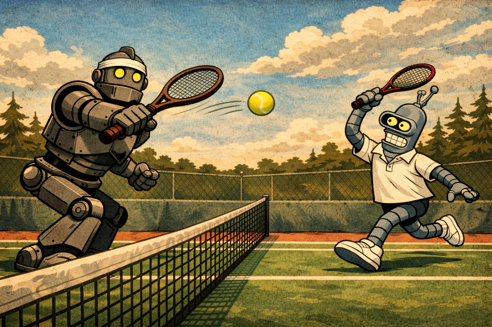

# Historical Tennis Match Outcome Prediction Project

  

## Project Overview

This project explores historical ATP tennis match data to identify the key factors that influence match outcomes and to build a machine learning model capable of predicting the winner of future matches.

## Data

The data is sourced from the publically available Jeff Sackmann ATP database [Jeff Sackmann ATP database](https://github.com/JeffSackmann), which contains detailed match-level data for professional tennis matches.

## Feature Engineering

The data was first cleaned by removing or correcting anomolous entries. The majority of these anomolous data was missing and could not be sourced using Wikipedia or the official ATP website. In other cases, erroneous values were found, like the player Jorge Brian Panta Herreros being listed with a height of just 3 cm.

Following the data cleaning, the match entries were ordered chronologically using the start date of the tournament and followed by the round of the tournament ("Q1", "Q2", "Q3", "R128", "R64", "R32", "R16", "QF", "SF", "F"). 

The first objective was to engineer features which could be utilised by the model. The first feature engineered was player's ELO ratings, a tool is most commonly used in chess to rank players based on their relative ability. Every player without any previous match history has their ELO set to 1500.

The expected probability of Player 1 winning a match ($P_1$) is calculated as:

$P_1 = \frac{1}{1 + 10^{(E_2 - E_1)/400}}$

Where $E_1$ and $E_2$ represent the pre-match ELO ratings of Player 1 and Player 2 respectively

Following the match, Player's ELO ratings are updated using:

$E_1' = E_1 + K \cdot (S_1 - P_1)$

Where $S_1 \in \{0,1\}$ indicates if Player 1 won the match, and $K$ is a scaling factor set to 32.  

Secondly, a surface ELO was calculated in the same way as the ELO but only calculating this metric for each player on a specific surface. 
